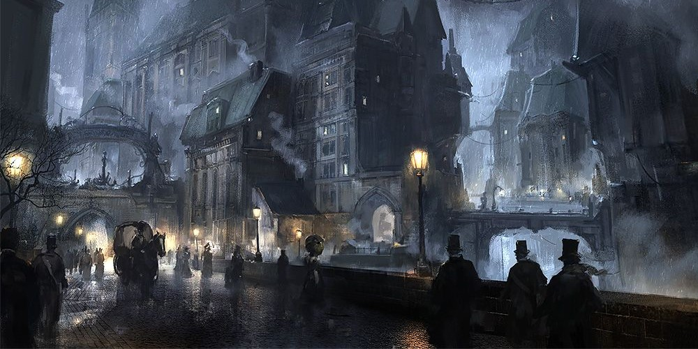
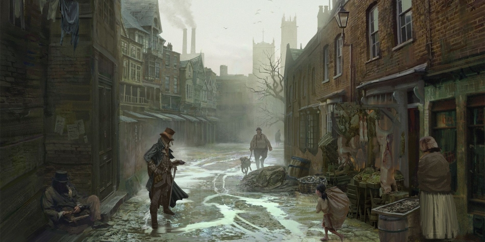
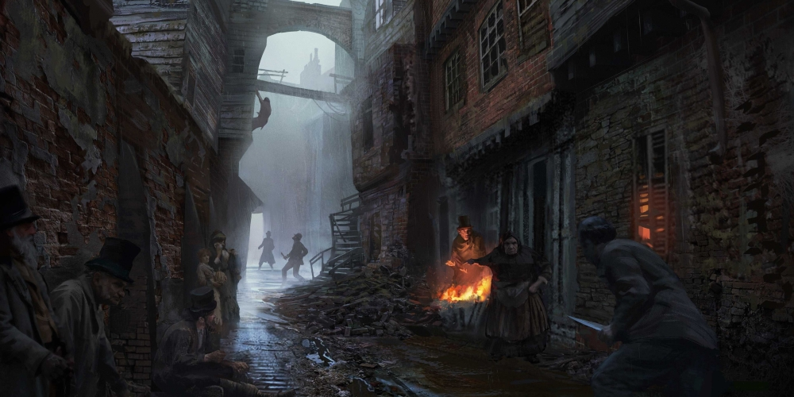
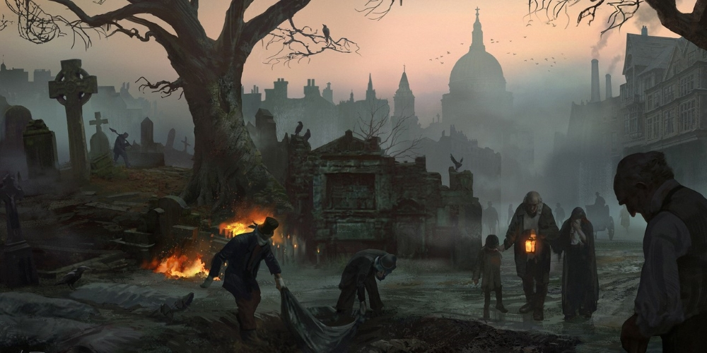

# Бекенд часть мультиплатформенного проекта "Undying form"

## Оглавление

1. [Статус проекта](#Статус-проекта)
2. [Планируемые платформы](#Планируемые-платформы)
3. [Общая идея этого проекта](#Общая-идея-этого-проекта)
4. [Основные моменты игры](#Основные-моменты-игры)
5. [Стек](#Стек)
6. [Backend](#Backend)
7. [Требования и пожелания к будущим участникам проекта](#Требования-и-пожелания-к-будущим-участникам-проекта)

## Статус проекта

Заморожен, возможно, навсегда, по причине отсутствия желающих участвовать в проекте.

~~Ведется поиск энтузиастов для участия в проекте. Нужны начинающие и не только:~~

- [Геймдизайнер](#Задачи-геймдизайнера)
- [Фронтендер](#Задачи-фронтендера) (отлично, если с навыками дизайнера)
- [Фронтендер](#Задачи-второго-фронтендера) (отлично, если с навыками дизайнера)
- [Мобильный разработчик](#Задачи-мобильного-разработчика)

## Планируемые платформы

- Браузер
- Android/iOS
- Телеграмм-бот

## Общая идея этого проекта

Free-to-play игра в стиле "тамагочи" и элементами роуглайта (roguelite) в мрачном и жестоком сеттинге.

Действие Undying form происходит в Восточной Европе викторианской эпохи (с 1837 по 1901 года). Прошло
немного времени после событий романа Мери Шелли «Франкенштейн, или Современный Прометей» и нашумевшие события привлекли
новых искателей запретных знаний. Этими искателями и будут игроки данного проекта.

Картинки, передающие атмосферу:

  
Нажмите, чтобы открыть спойлер

Все изображения были взяты из результатов поиска в интернете.

## Основные моменты игры

- Игрокам предстоит управлять, случайным образом подготовленным, ученым.
   ==================== Ученые ==================== 
- Ученый, как и его монстр с нами не навсегда - после череды неудачных экспериментов или рейда полицейских он может
  погибнуть или сойти с ума. После него остается только дневник с рецептами открытых экспериментов.
- Ученый имеет разные перки, полученные случайным образом, при подготовке персонажа.
- Ученый, в ходе развития, может получить одну из списка специализаций, которые заметно улучшат его результативность в
  поиске запретных знаний
- Ученый будет расхищать захоронения, склепы и могилы в поисках частей тел для сборки своего собственного
  подопытного монстра.
   ==================== Кладбища ==================== 
- Естественно, кладбища охраняются и за добычу придется побороться со смотрителями.
- Кладбища, как и районы - относятся к городу. На разных кладбищах захоронены разные социальные классы (крестьяне,
  рабочие, аристократы).
- Собранный конструктор-монстр будет помогать добывать ресурсы для безумных экспериментов. Его успешность и
  результативность будет зависеть от того, из каких частей тел он собран.
   ==================== Убежища, хранилища ==================== 
- Хранилище ресурсов, как и оборудование для экспериментов будет находиться в убежище, которое, в свою очередь,
  находится в одном из районов города.

**информация будет дополняться**

## Стек

### Backend

- Kotlin: 1.9.21
- Spring Boot: 3.2.0
- PostgreSQL: 15.5
- jOOQ: 3.19.3

## Требования и пожелания к будущим участникам проекта

Проект open source, в первую очередь направлен на получение опыта совместной разработки. Денег и мирового признания,
скорее всего, не будет, но если и когда проект будет завершен, то его должно быть не стыдно показать, например, будущему
работодателю. В условиях жесточайшей конкуренции на IT-рынке и повсеместных требований коммерческого опыта от года и
более - это хорошее предложение.

#### Задачи геймдизайнера

Основная задача - настройка и балансировка различных характеристик. Проектирование игрового опыта и разработка новых
механик, улучшение и расширение имеющихся. В качестве ограничений - указанные платформы (обсуждается) и навыки членов
команды.

#### Задачи фронтендера

Здесь все сложнее, ведь нужен вью для игроков, так и для администрирования проекта (изменение различных настроек,
внесение нового контента, редактирование уже существующего). На данный момент нет ограничений по выбору ЯП и
фреймворков. Глубокого понимания механик игры не требуется.

#### Задачи второго фронтендера

Telegram Mini Apps - это технология, которая позволяет очень просто и нативно запускать самописные веб-приложения прямо
внутри Telegram, а также предоставляет API для связи между вашим приложением и мессенджером, чтобы все было быстро и
отзывчиво.

В этой части проекта нужно реализовать удобный веб-интерфейс для игроков. Ранее, я смотрел в сторону телеграм-бота, но
количество механик и опций сделали бы интерфейс бота слишком перегруженным. На данный момент нет ограничений по выбору
ЯП и фреймворков. Глубокого понимания механик игры не требуется.

#### Задачи мобильного разработчика

Написать мобильное приложение для взаимодействия с бекендом. Для начала, будет достаточно и Android-платформы. Глубокого
понимания механик игры не требуется.